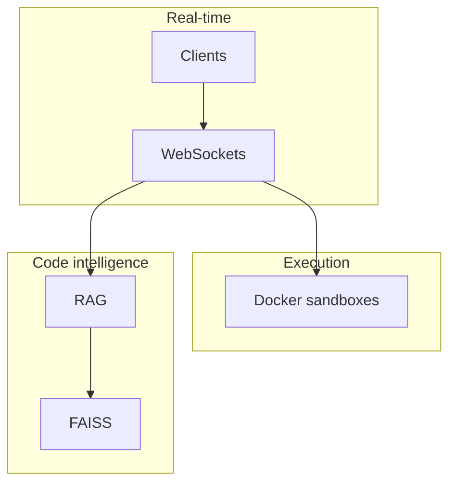

<div align="center">

<!-- Slice-style banner reads more "editorial" than the default rounded bar -->


<br/>


<br/>

<p align="center">
  <strong>Hassan, Karnataka</strong> · he/him<br/>
  <sub>Open source · <a href="https://github.com/apache/airflow">Apache Airflow</a> · <a href="https://github.com/pulls?q=is%3Apr+author%3ALohith625+is%3Amerged">merged PRs</a></sub>
</p>

<br/>

<!-- Custom "credibility" strip — always loads (unlike third‑party trophy APIs) -->
<p align="center">
  
  
  
</p>

<br/>

[](https://github.com/Lohith625)
[](https://www.linkedin.com/in/lohith-m-601021391/)
[](https://mlohith.netlify.app)
[](https://leetcode.com/Lohith-625)
[](mailto:mlohith25@gmail.com)

<br/>


</div>

---

## Snapshot

<table>
<tr>
<td width="58%" valign="top">

I ship **low-latency systems** people can run in production: **real-time** collaboration, **Docker-sandboxed** execution, and **RAG** that stays fast as the repo grows.

| | |
|:---|:---|
| **Proof** | PRs merged into **Apache Airflow** (massive real-world adoption) |
| **Builds** | **DevCollab** (~1–5ms sync) · **Codebase RAG** (~11ms retrieval / 4.3k+ chunks) |
| **Talk to me about** | WebSockets · Docker · vector search · Airflow internals |

</td>
<td width="42%" valign="top" align="center">


```javascript
const lohith = {
  location: "Hassan, Karnataka 🇮🇳",
  lanes: ["real-time", "OSS", "RAG"],
  rule: "Measure before you memoize.",
};
```

</td>
</tr>
</table>

## How the pieces connect



## Stack

<p align="center">

</p>
<p align="center">


</p>

## Signature work

<div align="center">
<table>
<tr>
<td width="50%" valign="top">

### ⚡ DevCollab
> Real-time collaborative coding — Docker-sandboxed, built for speed.

```
10+ concurrent users
1–5ms sync latency
~1.3s sandbox execution
```


</td>
<td width="50%" valign="top">

### 🧠 Codebase RAG
> Ask your codebase anything — answers in milliseconds.

```
4,300+ code chunks indexed
~11ms query latency (FAISS)
100% test pass rate
```


</td>
</tr>
<tr>
<td width="50%" valign="top">

### 🖼️ Pixora
> Images with auth and CDN delivery that holds up.

```
Google OAuth + JWT auth
Cloudinary CDN delivery
Tailwind responsive UI
```


</td>
<td width="50%" valign="top">

### 🌊 Apache Airflow
> OSS at serious scale — real reviews, real merges.

```
50,000+ GitHub stars
Multiple merged PRs
UI · Docs · Import fixes
```


[View merged PRs →](https://github.com/pulls?q=is%3Apr+author%3ALohith625+is%3Amerged)

</td>
</tr>
</table>
</div>

---

## Live GitHub insights

<sub>GitHub’s “trophy” image API is often offline (503). This section uses <strong>profile summary cards</strong> instead — same bragging rights, more reliable.</sub>

<div align="center">

<!-- Profile summary cards — distinct “dashboard” look vs generic stats widgets -->

<br/><br/>


<br/><br/>


<br/><br/>

<!-- Streak: demola mirror (Heroku instance is flaky for many users) -->


<br/><br/>


<br/><br/>


</div>

---

<div align="center">


<br/><br/>


</div>
