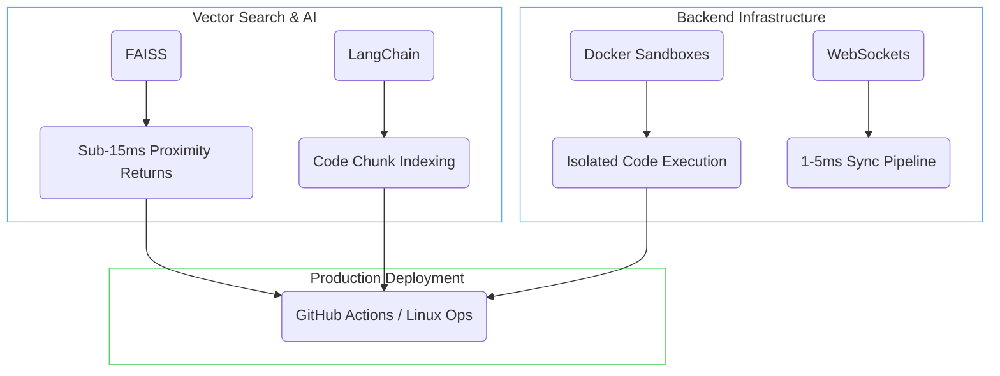

<div align="center">

<h1>Lohith M</h1>

<a href="https://git.io/typing-svg">
  
</a>

<br><br>

<a href="https://www.linkedin.com/in/lohith-m-601021391/"></a>
<a href="https://mlohith.netlify.app"></a>
<a href="https://leetcode.com/Lohith-625"></a>
<a href="mailto:mlohith25@gmail.com"></a>


</div>

<br>

## `>_ config.yaml`

```yaml
---
architect: Lohith M
location: Hassan, Karnataka 🇮🇳
focus:
  - systems-engineering
  - real-time-synchronization (1-5ms latencies)
  - scalable-ai-tooling (RAG pipelines via FAISS)
open_source:
  "Apache Airflow": "Core Contributor (Merged PRs covering UI, Docs, and Fixes)"
principles:
  - "Ship scalable code."
  - "Measure aggressively."
  - "Harden under load."
...
```

<br>

## `>_ core-stack.json`

<table width="100%" style="background-color: transparent; border: none;">
  <tr>
    <td width="50%" valign="top">
      <h4><code>systems & logic</code></h4>
      
    </td>
    <td width="50%" valign="top">
      <h4><code>infra & deployment</code></h4>
      
    </td>
  </tr>
  <tr>
    <td width="50%" valign="top">
      <h4><code>data & search</code></h4>
      
      <br><br>
      
      
      
    </td>
    <td width="50%" valign="top">
      <h4><code>frontend</code></h4>
      
    </td>
  </tr>
</table>

<br>

<details>
<summary><b><code>>_ cat ./mental-model.mermaid</code></b> (Click to Expand Blueprint)</summary>


</details>

<br>

## `>_ signature-architecture`

<div align="center">
  <table width="100%">
    <tr>
      <td width="50%" align="center">
        <a href="https://github.com/Lohith625/Devcollab">
          
        </a>
      </td>
      <td width="50%" align="center">
        <a href="https://github.com/Lohith625/codebase-rag">
          
        </a>
      </td>
    </tr>
    <tr>
      <td width="100%" colspan="2" align="center">
        <a href="https://github.com/Lohith625/airflow">
          
        </a>
      </td>
    </tr>
  </table>
  
  <br>
  <a href="https://github.com/Lohith625/Devcollab"></a>
  <a href="https://github.com/Lohith625/codebase-rag"></a>
</div>

<br>

## `>_ diagnostics.json`

<div align="center">
  
  
</div>

<div align="center">
  
</div>

<div align="center">
  
</div>

<div align="center">
  <picture>
    <source media="(prefers-color-scheme: dark)" srcset="https://raw.githubusercontent.com/Lohith625/Lohith625/output/github-contribution-grid-snake-dark.svg">
    <source media="(prefers-color-scheme: light)" srcset="https://raw.githubusercontent.com/Lohith625/Lohith625/output/github-contribution-grid-snake.svg">
    
  </picture>
</div>
