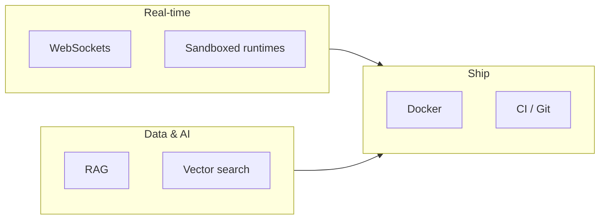

<div align="center">

<!-- Header: rounded gradient only — no subtitle inside the image (avoids blob overlap & tiny unreadable text) -->


<br/>

<h3 align="center">Software engineer · Systems · Real-time · AI tooling</h3>
<p align="center">
  <strong>Hassan, Karnataka</strong> · he/him · <em>Open-source contributor (Apache Airflow)</em>
</p>

<!-- Wider canvas + shorter lines = nothing gets clipped mid-word -->
<a href="https://git.io/typing-svg">

</a>

<br/><br/>

[](https://github.com/Lohith625)
[](https://www.linkedin.com/in/lohith-m-601021391/)
[](https://mlohith.netlify.app)
[](https://leetcode.com/Lohith-625)
[](mailto:mlohith25@gmail.com)

<br/>


</div>

---

## What I do

<table>
<tr>
<td width="55%" valign="top">

I build **low-latency, production-minded systems**: real-time collaboration, **Docker-sandboxed** execution, and **RAG** pipelines that stay predictable when data grows.

**Highlights**

- **Apache Airflow** — merged PRs into widely used production OSS  
- **DevCollab** — multi-user coding, **~1–5ms** sync, sandboxed runs  
- **Codebase RAG** — **4,300+** chunks indexed, **~11ms** retrieval (FAISS)  
- Ask me about **WebSockets · Docker · RAG · Airflow**

</td>
<td width="45%" valign="top" align="center">


```javascript
const lohith = {
  location: "Hassan, Karnataka 🇮🇳",
  focus: ["real-time", "OSS", "RAG"],
  mantra: "Ship, measure, harden, repeat.",
};
```

</td>
</tr>
</table>

## Mental model



## Tech stack

**Languages**

<p align="center">

</p>

**Frontend**

<p align="center">

</p>

**Backend & real-time**

<p align="center">

</p>
<p align="center">

</p>

**Data, AI & search**

<p align="center">

</p>
<p align="center">


</p>

**DevOps**

<p align="center">

</p>
<p align="center">

</p>

## Signature work

<div align="center">
<table>
<tr>
<td width="50%" valign="top">

### ⚡ DevCollab
> Real-time collaborative coding — Docker-sandboxed, built for speed.

Multi-user sync with sandboxed execution so nobody nukes the host.

```
10+ concurrent users
1–5ms sync latency
~1.3s sandbox execution
```


</td>
<td width="50%" valign="top">

### 🧠 Codebase RAG
> Ask your codebase anything — answers in milliseconds.

Chunk, embed, retrieve with FAISS + LangChain.

```
4,300+ code chunks indexed
~11ms query latency (FAISS)
100% test pass rate
```


</td>
</tr>
<tr>
<td width="50%" valign="top">

### 🖼️ Pixora
> Images with auth and CDN delivery that holds up.

Google OAuth, JWT, Cloudinary — wired properly.

```
Google OAuth + JWT auth
Cloudinary CDN delivery
Tailwind responsive UI
```


</td>
<td width="50%" valign="top">

### 🌊 Apache Airflow
> OSS used at serious scale — real reviews, real merges.

```
50,000+ GitHub stars
Multiple merged PRs
UI · Docs · Import fixes
```


[View merged PRs →](https://github.com/pulls?q=is%3Apr+author%3ALohith625+is%3Amerged)

</td>
</tr>
</table>
</div>

## GitHub activity

<div align="center">


<br/><br/>


<br/><br/>


<br/><br/>


<br/><br/>


</div>

---

<div align="center">

<sub>Refresh the page for a new quote.</sub>


<br/><br/>


</div>
